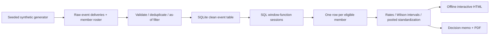

# Architecture and design decisions

## Deliberate choices

- **SQLite + CSV:** easy to run and inspect without installing a warehouse.
  This demonstration proves SQL/data reasoning, not Spark or distributed scale.
- **Standard-library pipeline:** reproducibility with no runtime network access.
  ReportLab is optional and used only for the PDF.
- **Rebuild from immutable raw fixture:** makes corrections auditable and reruns
  idempotent at analytical-content level. This is a full rebuild, not an
  incremental warehouse implementation. No production scheduling is included.
- **Conflict quarantine:** selecting one of two conflicting event payloads would
  manufacture certainty. The audit counts excluded rows explicitly.
- **Member-grain SQL with EXISTS:** one member cannot be counted multiple times
  merely because their session emitted more heartbeats.
- **Static HTML + embedded data:** filters work offline, data stays local, and
  the owner can share a selected artifact without operating a service.

## Production changes would be needed

Schema contracts and migrations; instrumented session/content IDs; append-only
raw storage; access controls; automated data-quality alerts; ingestion watermarks;
incremental restatement logic; household and repeated-exposure treatment; scalable
query storage; owner-defined experiment governance; and independent metric review.
These are documented boundaries, not features claimed to exist here.

## Threat and data scope

No credentials, external endpoints, customer data or employer source code.
The generator is the sole data source. Dashboard data is embedded via JSON with
less-than signs escaped, with fixed synthetic identifiers in CSV export.
The loader is intended for its own synthetic schema, not arbitrary untrusted
customer uploads. The project makes no security certification claim.
