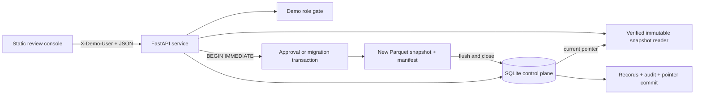

# Architecture

## Purpose and boundary

Governed Data Service is a local single-host portfolio demo using fictional equipment-inspection data. It shows a control pattern around mutable records and immutable analytical files; it is not a reproduction of an employer system.

SQLite is authoritative for records, proposals, audit events, idempotency receipts, schema phase, and the current snapshot pointer. A snapshot uses fictional records partitioned by `observed_date`; its manifest records expected hashes and row counts.

For approval or a schema transition, the service serializes writers with `BEGIN IMMEDIATE`, validates and changes SQLite state, creates a uniquely named Parquet snapshot and manifest, flushes/closes those files, then commits the record, audit event, and pointer together. Readers resolve the committed pointer and verify/read immutable files. A published version is never overwritten.

This is a local publication protocol, not an arbitrary transactional update mechanism for Parquet or a distributed transaction manager. A failure before the SQLite commit rolls back the record, audit, and pointer change; created files may remain orphaned. Orphans are not surfaced as published data and are never deleted automatically.

## Workflow and migration

An `analyst` submits a versioned proposal. A different `reviewer` approves or rejects it. Approval repeats the revision check inside the serialized transaction, preventing stale changes from overwriting newer data. Delete is soft: dataset reads omit the record while audit retains its event. Idempotency receipts are scoped to demo principal, operation, and payload.

The synthetic migration is ordered: legacy v1 `reading`; expand physically adds v2 `measurement_value` and enables dual writes; backfill copies historical values; contract verifies equality/non-null invariants, then rebuilds the SQLite table without the legacy field, where v2 is required and v1 gets an explicit retirement response. Each transition is audited and published by the same protocol.

## Limits

`X-Demo-User` values are intentionally impersonable, so they demonstrate workflow policy but not production IAM. There is no cloud replication, encryption/key management integration, tamper-proof log, or multi-host coordination. Local SQLite and filesystem durability depend on the host/storage configuration. No user-controlled filesystem paths are accepted.

## References

- [SQLite transaction control](https://www.sqlite.org/lang_transaction.html) — `BEGIN IMMEDIATE` writer-lock behavior and possible busy conditions.
- [PyArrow `write_table`](https://arrow.apache.org/docs/python/generated/pyarrow.parquet.write_table.html) — Parquet-writing API used for immutable publication files.
- [FastAPI testing](https://fastapi.tiangolo.com/tutorial/testing/) — framework testing guidance for the local API.
